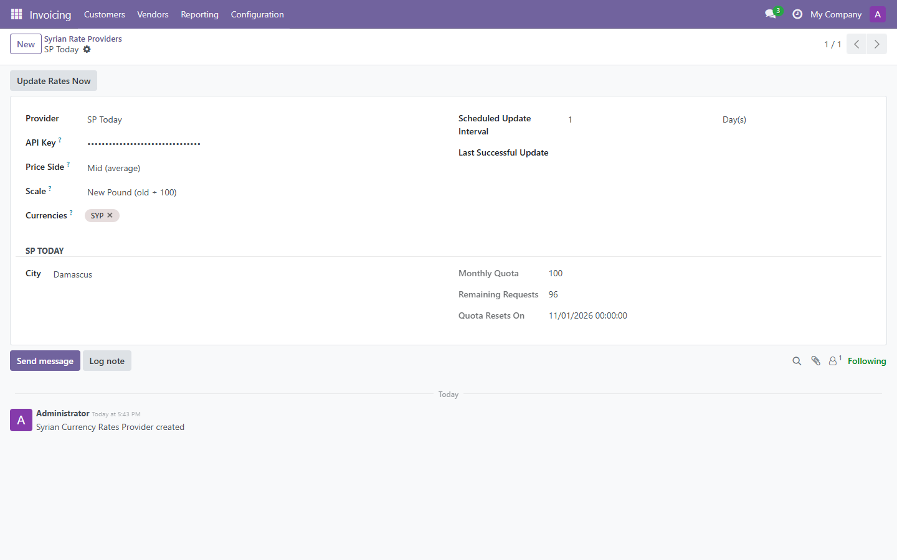
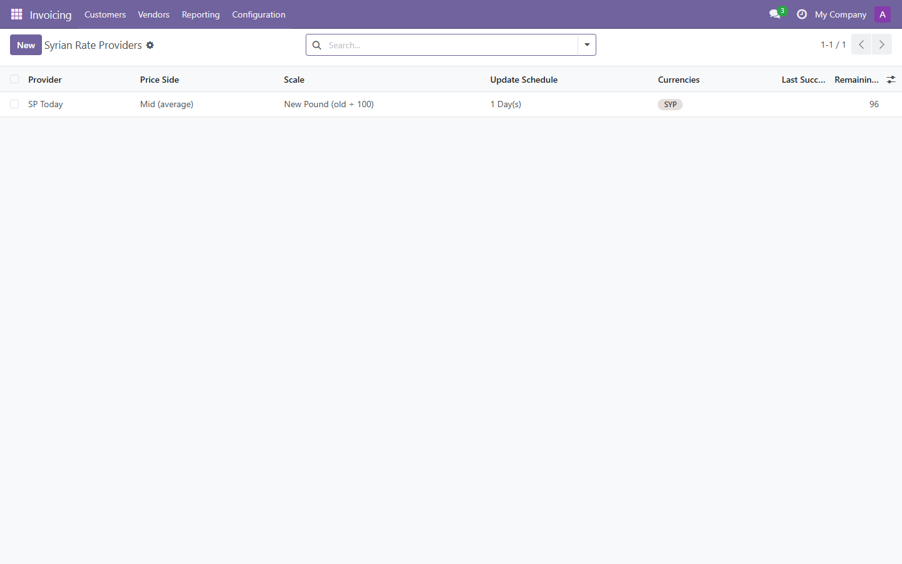
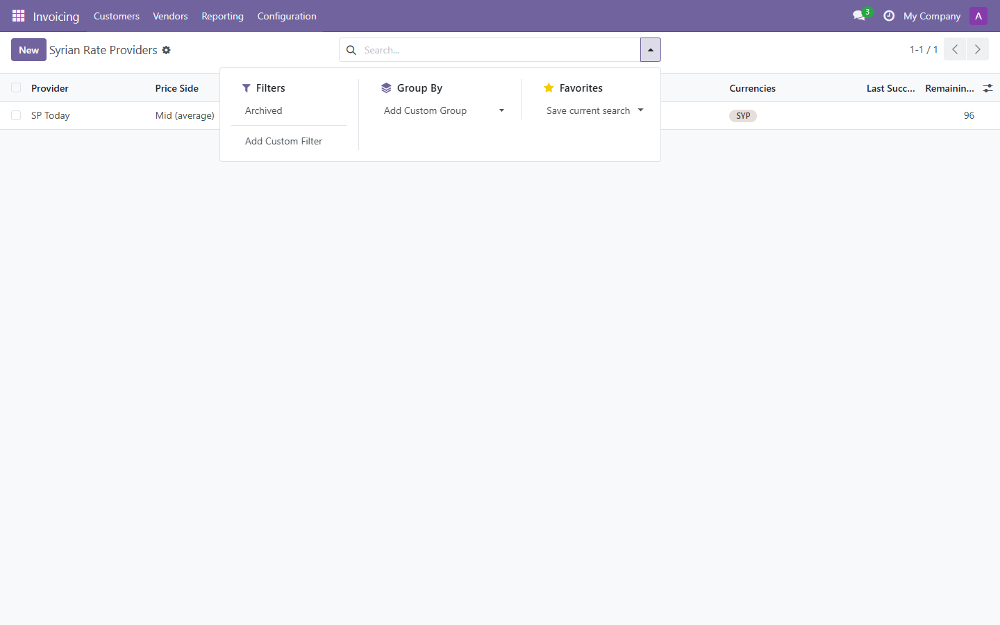
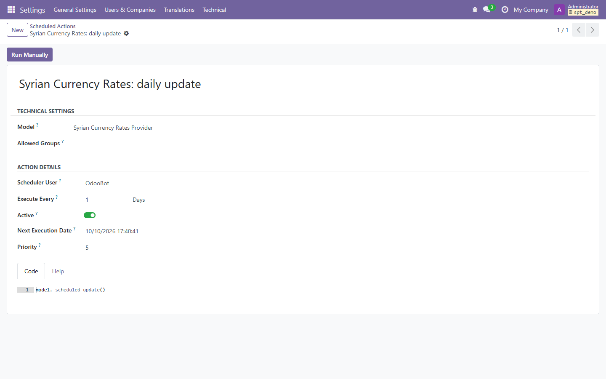
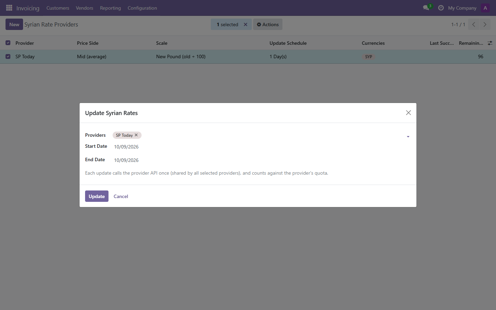
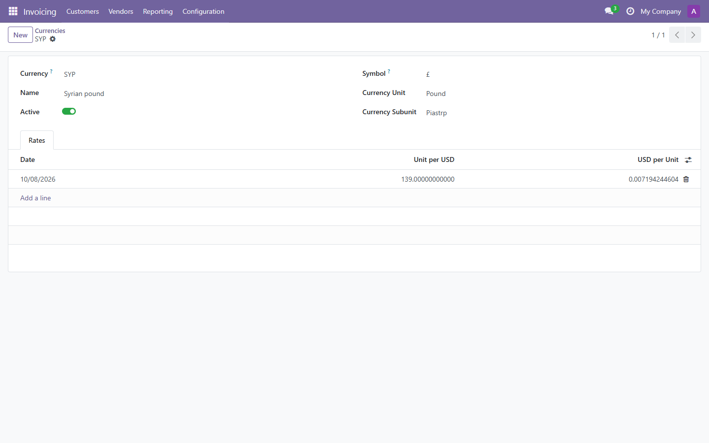

# Odoo-SPT

 Odoo API integration that keeps **Syrian Pound (SYP)** exchange rates up to date from Syrian
 market rate providers. The supported provider in this module is **[SP Today](https://sp-today.com)**,
 and the design is extensible to other sources.

 ## Features
 - Fetches SYP market rates from the SP Today API (Damascus, Aleppo or Homs)
 - One rate provider per company (multi-company safe)
 - Choice of price side: **Buy**, **Sell** or **Mid (average)**. Buy and sell are stored on the rate as well.
 - Old / new Syrian pound scale (new = old ÷ 100), converted automatically
 - Scheduled updates at a configurable interval (days / weeks / months)
 - Manual update: an **Update Rates Now** button, plus a wizard for a date range
 - Shows the remaining API quota (monthly limit, remaining requests, reset date)
 - Coexists with other currency rate providers without conflicts

 ## Requirements
 - Odoo (one branch per version, e.g. `18.0`)
 - Odoo modules: `account`, `mail`
 - Python: `requests`, `pytz`
 - An SP Today API key

 ## Installation
 1. Clone the branch that matches your Odoo version into your addons path:
    `git clone -b 18.0 https://github.com/yakhras/Odoo-SPT.git`
 2. Restart Odoo, update the apps list, and install **SPT**.

 ## Configuration
  1. Go to **Invoicing / Accounting → Configuration → Syrian Rate Providers** and create a provider.
  2. Set the service (**SP Today**), the city, the API key (administrators only), the price side, the scale and the update interval.
  3. Save. Rates are then updated by the scheduled action, or right away with **Update Rates Now**.

  

  All providers are listed with their price side, scale, schedule and remaining API quota:

  

  Archived providers can be found with the **Archived** filter:

  

  ## Usage
  ### Automatic updates
  The scheduled action **Syrian Currency Rates: daily update** runs every day. It updates each provider whose next update date has been reached.

  

  ### Manual updates
  To update several providers at once, select them in the provider list and run **Actions → Update Syrian Rates**.
  Each run calls the provider API once, and that call counts against the provider's quota.

  

  ### Rates
  Rates appear under **Configuration → Currencies → SYP → Rates**.

  
  
 ## Author
 Yaser Akhras ([yaserakhras.com](https://yaserakhras.com))

 ## License
 LGPL-3. See [LICENSE](LICENSE).
